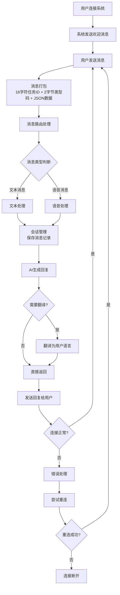

```mermaid
  flowchart TD
      A[用户连接系统] --> B[系统发送欢迎消息]
      B --> C[用户发送消息]
      C --> D[消息打包<br/>16字符任务ID + 2字节类型码 + JSON数据]
      D --> E[消息路由处理]
      E --> F{消息类型判断}
      F -->|文本消息| G[文本处理]
      F -->|语音消息| H[语音处理]
      G --> I[会话管理<br/>保存消息记录]
      H --> I
      I --> J[AI生成回复]
      J --> K{需要翻译?}
      K -->|是| L[翻译为用户语言]
      K -->|否| M[直接返回]
      L --> M
      M --> N[发送回复给用户]
      N --> O{连接正常?}
      O -->|是| C
      O -->|否| P[错误处理]
      P --> Q[尝试重连]
      Q --> R{重连成功?}
      R -->|是| C
      R -->|否| S[连接断开]
```