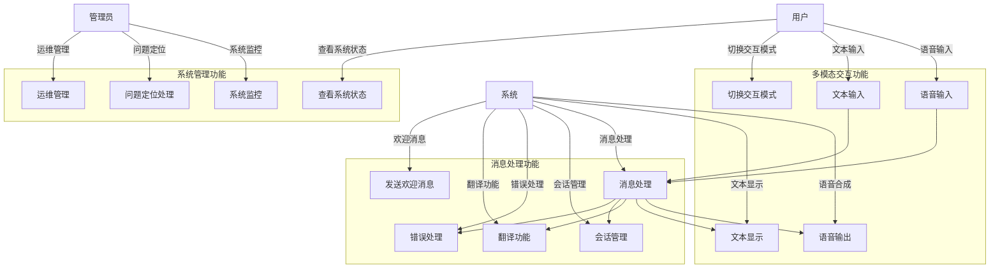

```mermaid
graph TD
      User[用户] --> |语音输入| VoiceInput[语音输入]
      User --> |文本输入| TextInput[文本输入]
      User --> |切换交互模式| SwitchMode[切换交互模式]
      User --> |查看系统状态| ViewStatus[查看系统状态]

      Admin[管理员] --> |系统监控| SystemMonitor[系统监控]
      Admin --> |问题定位| TroubleShooting[问题定位处理]
      Admin --> |运维管理| Operations[运维管理]

      System[系统] --> |语音合成| VoiceOutput[语音输出]
      System --> |文本显示| TextOutput[文本显示]
      System --> |消息处理| MessageProcess[消息处理]
      System --> |会话管理| SessionManage[会话管理]
      System --> |错误处理| ErrorHandle[错误处理]
      System --> |翻译功能| Translation[翻译功能]
      System --> |欢迎消息| WelcomeMessage[发送欢迎消息]

      VoiceInput --> MessageProcess
      TextInput --> MessageProcess
      MessageProcess --> VoiceOutput
      MessageProcess --> TextOutput
      MessageProcess --> Translation
      MessageProcess --> SessionManage
      MessageProcess --> ErrorHandle

      subgraph "多模态交互功能"
          VoiceInput
          TextInput
          VoiceOutput
          TextOutput
          SwitchMode
      end

      subgraph "消息处理功能"
          MessageProcess
          SessionManage
          ErrorHandle
          Translation
          WelcomeMessage
      end

      subgraph "系统管理功能"
          SystemMonitor
          TroubleShooting
          Operations
          ViewStatus
      end
```