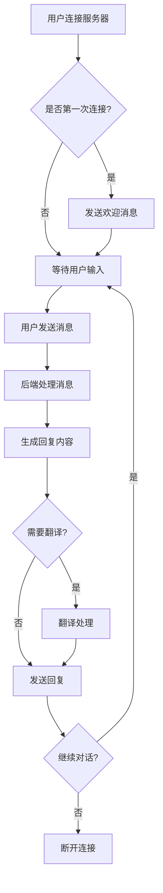

```mermaid

  flowchart TD
      A[用户连接服务器] --> B{是否第一次连接?}
      B -->|是| C[发送欢迎消息]
      B -->|否| D[等待用户输入]
      C --> D
      D --> E[用户发送消息]
      E --> F[后端处理消息]
      F --> G[生成回复内容]
      G --> H{需要翻译?}
      H -->|是| I[翻译处理]
      H -->|否| J[发送回复]
      I --> J
      J --> K{继续对话?}
      K -->|是| D
      K -->|否| L[断开连接]
```