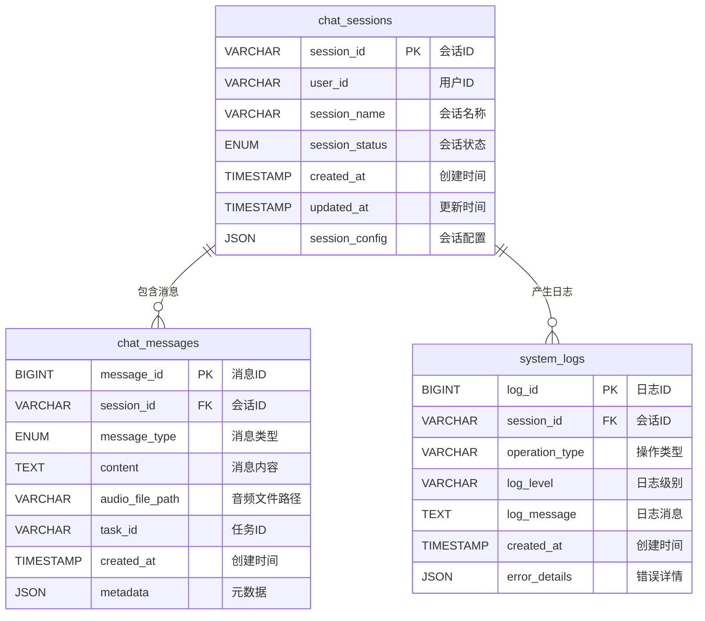

```mermaid
 erDiagram
      chat_sessions {
          VARCHAR session_id PK "会话ID"
          VARCHAR user_id "用户ID"
          VARCHAR session_name "会话名称"
          ENUM session_status "会话状态"
          TIMESTAMP created_at "创建时间"
          TIMESTAMP updated_at "更新时间"
          JSON session_config "会话配置"
      }

      chat_messages {
          BIGINT message_id PK "消息ID"
          VARCHAR session_id FK "会话ID"
          ENUM message_type "消息类型"
          TEXT content "消息内容"
          VARCHAR audio_file_path "音频文件路径"
          VARCHAR task_id "任务ID"
          TIMESTAMP created_at "创建时间"
          JSON metadata "元数据"
      }

      system_logs {
          BIGINT log_id PK "日志ID"
          VARCHAR session_id FK "会话ID"
          VARCHAR operation_type "操作类型"
          VARCHAR log_level "日志级别"
          TEXT log_message "日志消息"
          TIMESTAMP created_at "创建时间"
          JSON error_details "错误详情"
      }

      chat_sessions ||--o{ chat_messages : "包含消息"
      chat_sessions ||--o{ system_logs : "产生日志"
```