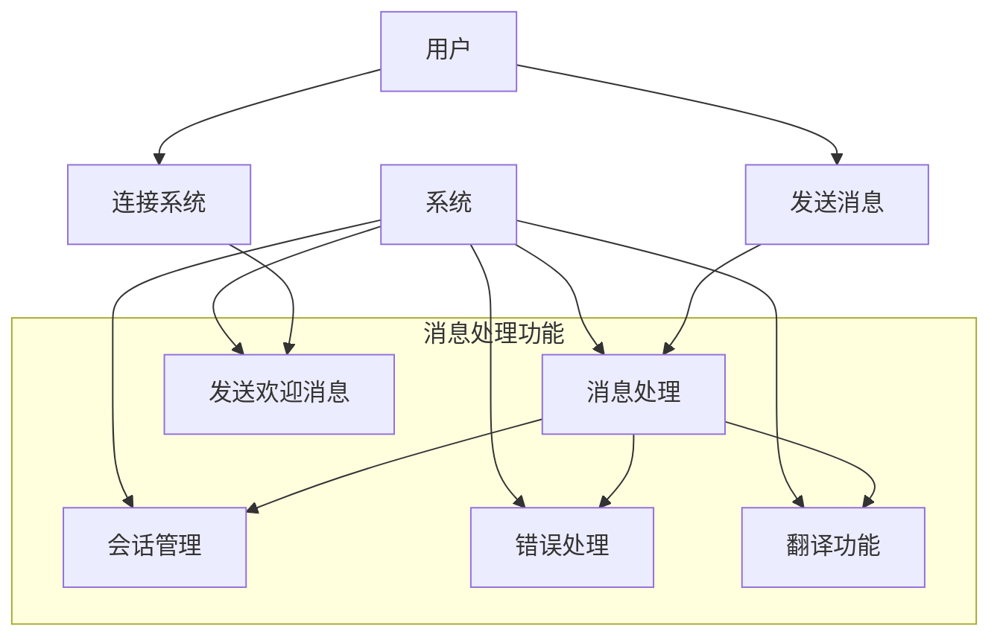

```mermaid
  graph TD
      User[用户] --> ConnectSystem[连接系统]
      User --> SendMessage[发送消息]

      System[系统] --> MessageProcess[消息处理]
      System --> SessionManage[会话管理]
      System --> ErrorHandle[错误处理]
      System --> Translation[翻译功能]
      System --> WelcomeMessage[发送欢迎消息]

      ConnectSystem --> WelcomeMessage
      SendMessage --> MessageProcess
      MessageProcess --> SessionManage
      MessageProcess --> ErrorHandle
      MessageProcess --> Translation

      subgraph "消息处理功能"
          MessageProcess
          SessionManage
          ErrorHandle
          Translation
          WelcomeMessage
      end
```