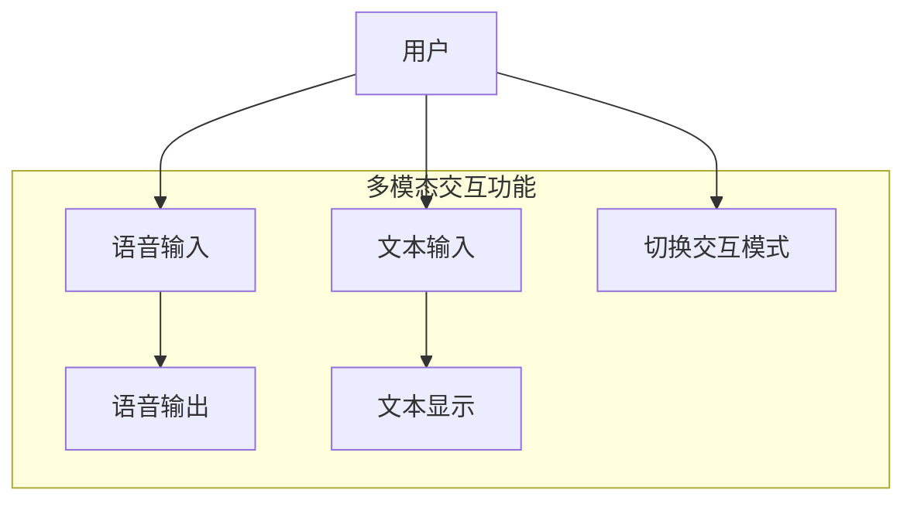

```mermaid
  graph TD
      User[用户] --> VoiceInput[语音输入]
      User --> TextInput[文本输入]
      User --> SwitchMode[切换交互模式]

      VoiceInput --> VoiceOutput[语音输出]
      TextInput --> TextOutput[文本显示]

      subgraph "多模态交互功能"
          VoiceInput
          TextInput
          VoiceOutput
          TextOutput
          SwitchMode
      end
```